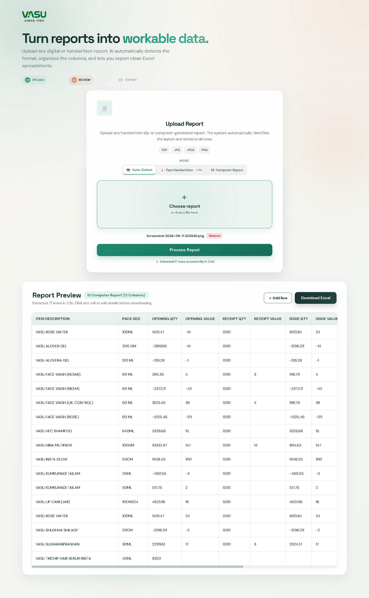

<p align="center">
  
</p>

<h1 align="center">Report2Excel</h1>

<p align="center">
  Turn computer-generated and handwritten report sheets into clean, formatted Excel files.
</p>

---

## Overview

Report2Excel is a web app that converts **report sheets (PDFs and images) into formatted Excel spreadsheets (`.xlsx`)**. It uses a Vision AI API to read the report, lets you fix any mistakes on screen, and exports a ready-to-use Excel file.

> **Note:** This tool was built for a specific report layout used at Vasu. The Vasu name and logo belong to their owner and are shown here only to identify the report format it was built for. No company data is included in this repository.

## Screenshots

| Upload | Review and Edit |
| :---: | :---: |
|  |  |

*Screenshots use dummy data.*

---

## Features

- **Fast processing:** images are resized and compressed with Sharp before upload, so extraction usually takes about 1.5 to 5 seconds.
- **Three modes:**
  - **Auto-Detect (default):** identifies the report layout by itself.
  - **Fast Handwritten:** built for notebook pages and handwritten slips. It solves written sums (`96+36=142` becomes `142`), resolves ditto marks (`"`) and removes unit words like `pcs` and `box`.
  - **Computer Report:** extracts a 12-column stock and sales report.
- **Edit in the browser:** click any cell to fix it, add missing rows, or delete rows.
- **Responsive design:** works on phones, tablets and desktops.
- **Excel export:**
  - Dark emerald header with white bold text
  - Auto-fitted column widths
  - Number formatting (`#,##0`) for quantities
  - Automatic `TOTAL` row
  - Light borders on all cells, ready for printing

## Supported Report Formats

| | Handwritten Slip | Computer-Generated Report |
| :--- | :--- | :--- |
| **Typical source** | Notebook pages, handwritten slips | Printed or PDF stock sheets |
| **Columns** | `SR.NO`, `ITEM NAME`, `PACK SIZE`, `QUANTITY` | `ITEM DESCRIPTION`, `PACK SIZE`, `OPENING QTY/VALUE`, `RECEIPT QTY/VALUE`, `ISSUE QTY/VALUE`, `CLOSING QTY/VALUE`, `DUMP QTY`, `M.EXP` |
| **Math solver** | Yes | Not needed |
| **Average speed** | ~1.5 to 2.5 s | ~3 to 5 s |
| **Needs API key** | Yes | Yes |

---

## Tech Stack

- **Backend:** Node.js, Express
- **AI:** Vision AI API (Groq / xAI Grok)
- **Image and PDF handling:** Sharp, pdf-lib
- **Excel generation:** ExcelJS
- **Frontend:** HTML, CSS, JavaScript (no UI framework)

---

## Getting Started

### 1. Prerequisites
Node.js 18 or newer.

### 2. Install
```bash
git clone https://github.com/iamaadii/Report2Excel.git
cd Report2Excel/sourceCode
npm install
```

### 3. Configure
Create a `.env` file inside `sourceCode`:
```env
GROK_API_KEY=your_api_key_here
```
Never commit this file. It is listed in `.gitignore`.

### 4. Run
```bash
npm run dev     # development with auto-reload
npm start       # production
```

### 5. Open
```text
http://localhost:5000
```

---

## How to Use

1. **Pick a mode:** Auto-Detect, Fast Handwritten, or Computer Report.
2. **Upload** a PDF, JPG, JPEG or PNG.
3. Click **Process Report**.
4. **Review** the table. Edit cells, add rows or delete rows as needed.
5. Click **Download Excel** to save the `.xlsx` file.

---

## Project Structure

```text
Report2Excel/
├── README.md
└── sourceCode/
    ├── server.js                    # Express server entry point
    ├── controllers/
    │   └── reportController.js      # Request validation, mode handling, Excel export
    ├── middleware/
    │   └── uploadMiddleware.js      # File upload checks (type and size)
    ├── public/                      # Frontend
    │   ├── index.html
    │   ├── style.css
    │   ├── script.js
    │   ├── favicon.svg
    │   └── logo.png
    ├── routes/
    │   └── reportRoutes.js          # API routes (/process, /download)
    ├── services/
    │   ├── reportExtractService.js  # Vision AI extraction and layout detection
    │   ├── pdfService.js            # PDF page to image conversion
    │   ├── excelService.js          # Styled .xlsx generator
    │   └── tempStorage.js           # Temporary file paths
    ├── uploads/                     # Temporary uploads (auto-cleaned)
    └── package.json
```

---

## License

For portfolio and demonstration purposes.